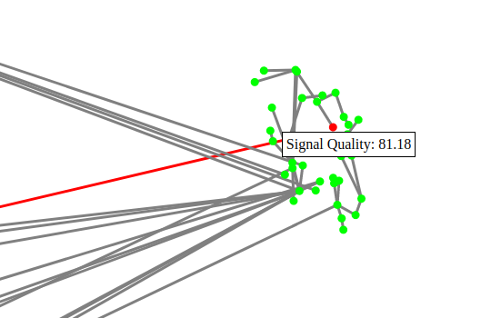
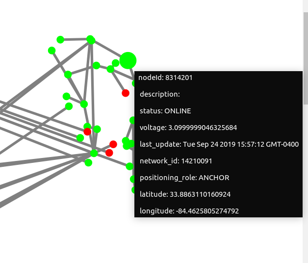

# Network Diagnostics Visualization




### Description

D3 visualization to help with diagnosing network connectivity issues. Takes a graphjson structure as input and displays all latitude and longitude coordinates as scaled down x and y plane coordinates according to a specificed Width and Height in pixels.

### Install Instructions

```bash
$ npm i
$ npm start
```
